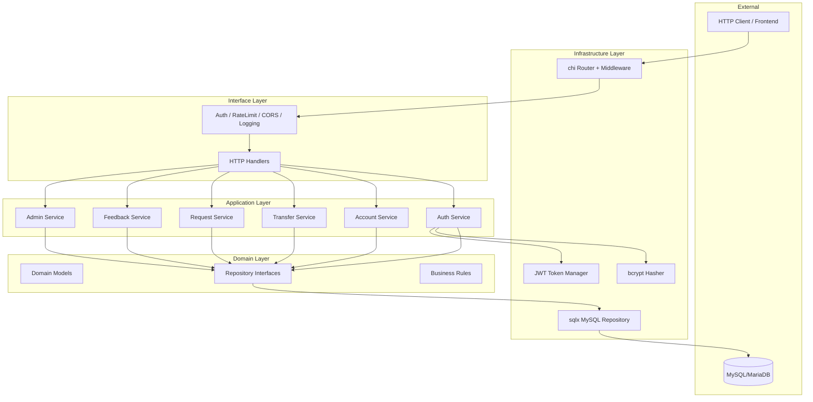
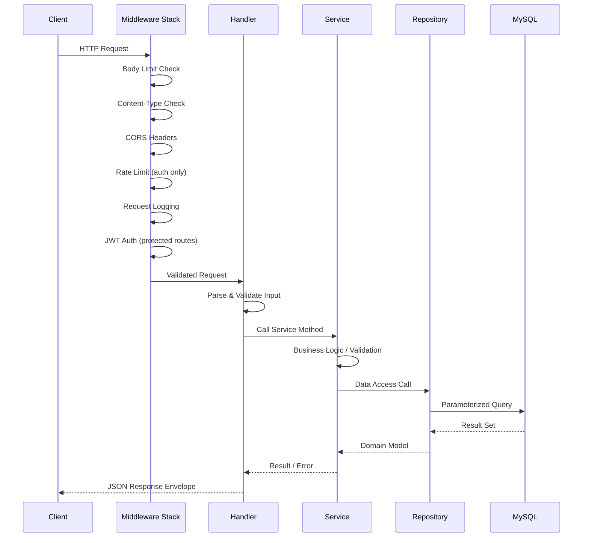
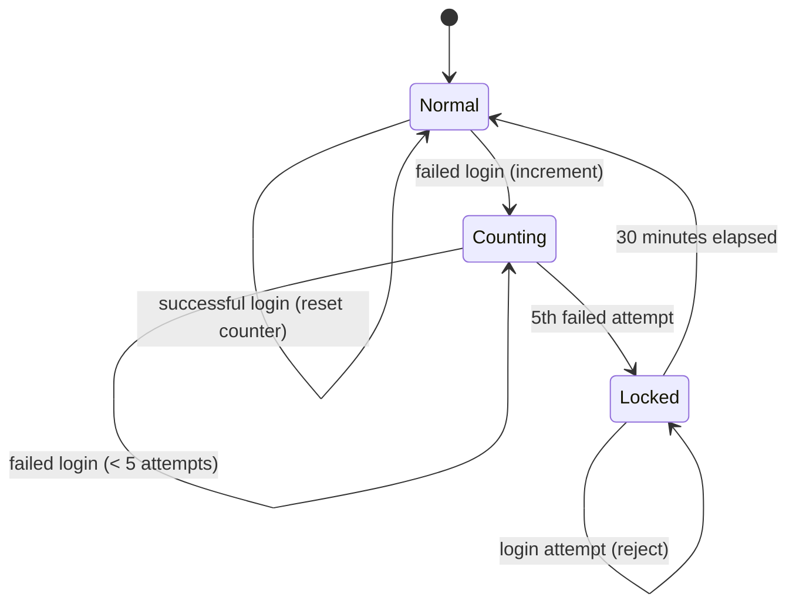

# Design Document: PHP to Golang Conversion

## Overview

This design describes the architecture for converting the existing PHP online banking monolith into a modern Go REST API backend. The PHP application currently renders HTML directly, uses plaintext passwords, and is vulnerable to SQL injection. The new Go service exposes RESTful JSON endpoints following clean architecture principles, with proper authentication (JWT + bcrypt), input validation, structured logging, and comprehensive test coverage.

The Go service will:
- Serve as a stateless REST API backend (no HTML rendering)
- Use JWT for authentication with role-based access control (customer vs admin)
- Apply bcrypt for all password hashing
- Use parameterized queries exclusively for database access
- Follow clean architecture with dependency injection
- Support the existing MySQL/MariaDB database schema (with migrations for security improvements)

### Technology Stack

| Layer | Technology |
|-------|-----------|
| Language | Go 1.22+ |
| HTTP Router | chi (lightweight, idiomatic, middleware-friendly) |
| Database Driver | go-sql-driver/mysql |
| SQL Builder | sqlx (struct scanning, named queries) |
| JWT | golang-jwt/jwt/v5 |
| Password Hashing | golang.org/x/crypto/bcrypt |
| Validation | go-playground/validator/v10 |
| Logging | zerolog (structured JSON logging) |
| Testing | testify + gomock |
| Migration | golang-migrate/migrate |
| Config | envconfig or os.Getenv with custom loader |
| Rate Limiting | In-memory token bucket (golang.org/x/time/rate) |

### Design Decisions

1. **chi router over gin/echo**: chi is a lightweight, stdlib-compatible router that doesn't impose framework opinions. It has composable middleware and integrates cleanly with `net/http`.
2. **sqlx over GORM**: Keeps SQL explicit and predictable. Avoids ORM magic that can produce unexpected queries in financial systems. Parameterized queries are visible and auditable.
3. **zerolog over zap**: Lower allocation, simpler API for structured JSON logging. No global logger—injected via context or constructor.
4. **In-memory rate limiter**: Sufficient for single-instance deployment. Can be swapped for Redis-based limiter via interface when horizontal scaling is needed.
5. **golang-migrate**: File-based migrations with up/down support, widely adopted, supports MySQL natively.

## Architecture

The system follows Clean Architecture (Ports & Adapters), separating concerns into layers where inner layers have no knowledge of outer layers.



### Project Structure

```
/cmd
    /api
        main.go                  # Application entry point, DI wiring
/internal
    /config
        config.go                # Environment variable loading
    /handler
        auth_handler.go          # Customer auth endpoints
        admin_handler.go         # Admin auth + management endpoints
        account_handler.go       # Registration, profile
        dashboard_handler.go     # Dashboard + transaction history
        transfer_handler.go      # Quick transfer endpoints
        request_handler.go       # Money request endpoints
        feedback_handler.go      # Feedback endpoints
        health_handler.go        # Health check endpoint
        response.go              # Unified response helpers
    /middleware
        auth.go                  # JWT verification middleware
        ratelimit.go             # Rate limiting middleware
        cors.go                  # CORS middleware
        logging.go               # Request logging middleware
        content_type.go          # Content-Type enforcement
        body_limit.go            # Request body size limit
        timeout.go               # Context timeout middleware
    /service
        auth_service.go          # Authentication business logic
        account_service.go       # Account/registration logic
        transfer_service.go      # Transfer business logic
        request_service.go       # Money request logic
        feedback_service.go      # Feedback logic
        admin_service.go         # Admin operations logic
    /repository
        account_repository.go    # Account data access
        customer_repository.go   # Customer data access
        transaction_repository.go# Transaction data access
        request_repository.go    # Request data access
        feedback_repository.go   # Feedback data access
        admin_repository.go      # Admin data access
        login_history_repository.go # Login history data access
    /model
        account.go               # Account domain model
        customer.go              # Customer domain model
        transaction.go           # Transaction domain model
        request.go               # Money request model
        feedback.go              # Feedback model
        admin.go                 # Admin model
        login_history.go         # Login history model
        pagination.go            # Pagination types
    /validator
        validator.go             # Custom validation rules
    /security
        hasher.go                # bcrypt password hasher interface + impl
        token.go                 # JWT token manager interface + impl
/pkg
    /response
        response.go              # Shared response envelope types
/migrations
    000001_initial_schema.up.sql
    000001_initial_schema.down.sql
    000002_alter_password_columns.up.sql
    000002_alter_password_columns.down.sql
    000003_add_foreign_keys.up.sql
    000003_add_foreign_keys.down.sql
    000004_add_indexes.up.sql
    000004_add_indexes.down.sql
    000005_hash_existing_passwords.up.sql
    000005_hash_existing_passwords.down.sql
/test
    /integration
        auth_test.go
        transfer_test.go
    /mock
        mock_repositories.go     # Generated mocks
/docs
    /api
        openapi.yaml
```

### Request Flow



## Components and Interfaces

### Core Interfaces

```go
// PasswordHasher abstracts password hashing operations
type PasswordHasher interface {
    Hash(password string) (string, error)
    Compare(hashedPassword, plainPassword string) error
}

// TokenManager abstracts JWT token operations
type TokenManager interface {
    Generate(claims TokenClaims) (string, error)
    Validate(tokenString string) (*TokenClaims, error)
    Invalidate(tokenString string) error
}

// TokenClaims holds JWT payload data
type TokenClaims struct {
    AccountNo int64  `json:"account_no"`
    Role      string `json:"role"` // "customer" or "admin"
    ExpiresAt time.Time
}
```

### Repository Interfaces

```go
// AccountRepository handles account data access
type AccountRepository interface {
    GetByUsername(ctx context.Context, username string) (*Account, error)
    GetByAccountNo(ctx context.Context, accountNo int64) (*Account, error)
    Exists(ctx context.Context, accountNo int64) (bool, error)
    UsernameExists(ctx context.Context, username string) (bool, error)
    Create(ctx context.Context, tx *sqlx.Tx, account *Account) (int64, error)
    UpdatePassword(ctx context.Context, accountNo int64, hashedPassword string) error
}

// CustomerRepository handles customer profile data
type CustomerRepository interface {
    GetByAccountNo(ctx context.Context, accountNo int64) (*Customer, error)
    Create(ctx context.Context, tx *sqlx.Tx, customer *Customer) error
    Update(ctx context.Context, customer *Customer) error
    ListAll(ctx context.Context, pagination Pagination) ([]Customer, int64, error)
}

// TransactionRepository handles transaction records
type TransactionRepository interface {
    Create(ctx context.Context, tx *sqlx.Tx, transaction *Transaction) error
    GetByAccountNo(ctx context.Context, accountNo int64, pagination Pagination) ([]Transaction, int64, error)
    GetAll(ctx context.Context, pagination Pagination) ([]Transaction, int64, error)
    GetSummary(ctx context.Context, accountNo int64) (*TransactionSummary, error)
    GetMonthlySummary(ctx context.Context, accountNo int64, year int, month int) (*TransactionSummary, error)
}

// BalanceRepository handles account balance operations
type BalanceRepository interface {
    GetByAccountNo(ctx context.Context, accountNo int64) (int64, error)
    Credit(ctx context.Context, tx *sqlx.Tx, accountNo int64, amount int64) (int64, error)
    Debit(ctx context.Context, tx *sqlx.Tx, accountNo int64, amount int64) (int64, error)
    Create(ctx context.Context, tx *sqlx.Tx, accountNo int64, accountType string, balance int64) error
}

// RequestRepository handles money request operations
type RequestRepository interface {
    Create(ctx context.Context, request *MoneyRequest) error
    GetReceivedByAccountNo(ctx context.Context, accountNo int64, pagination Pagination) ([]MoneyRequest, int64, error)
    MarkAsViewed(ctx context.Context, requestID int64) error
    GetAll(ctx context.Context, pagination Pagination) ([]MoneyRequest, int64, error)
}

// FeedbackRepository handles feedback data
type FeedbackRepository interface {
    Create(ctx context.Context, feedback *Feedback) error
    GetAll(ctx context.Context, pagination Pagination) ([]Feedback, int64, error)
}

// LoginHistoryRepository handles login tracking
type LoginHistoryRepository interface {
    RecordLogin(ctx context.Context, accountNo int64, ipAddress string) (int64, error)
    RecordLogout(ctx context.Context, tokenID int64) error
    GetByAccountNo(ctx context.Context, accountNo int64, pagination Pagination) ([]LoginHistory, int64, error)
    GetAll(ctx context.Context, pagination Pagination) ([]LoginHistory, int64, error)
    GetLatestByAccountNo(ctx context.Context, accountNo int64) (*LoginHistory, error)
}

// AdminRepository handles admin data access
type AdminRepository interface {
    GetByID(ctx context.Context, adminID int64) (*Admin, error)
    GetByEmail(ctx context.Context, email string) (*Admin, error)
}

// AddressRepository handles address data
type AddressRepository interface {
    Create(ctx context.Context, tx *sqlx.Tx, address *Address) error
    GetByAccountNo(ctx context.Context, accountNo int64) (*Address, error)
    Update(ctx context.Context, address *Address) error
}

// AccountTypeRepository handles account type data
type AccountTypeRepository interface {
    Create(ctx context.Context, tx *sqlx.Tx, accountNo int64, accountType string) error
    GetByAccountNo(ctx context.Context, accountNo int64) (string, error)
}
```

### Service Interfaces

```go
// AuthService handles authentication operations
type AuthService interface {
    CustomerLogin(ctx context.Context, req LoginRequest) (*LoginResponse, error)
    CustomerLogout(ctx context.Context, accountNo int64, tokenID int64) error
    AdminLogin(ctx context.Context, req LoginRequest) (*LoginResponse, error)
    IsAccountLocked(ctx context.Context, username string) (bool, time.Duration, error)
}

// AccountService handles registration and profile
type AccountService interface {
    Register(ctx context.Context, req RegisterRequest) (*RegisterResponse, error)
    GetProfile(ctx context.Context, accountNo int64) (*ProfileResponse, error)
    UpdateProfile(ctx context.Context, accountNo int64, req UpdateProfileRequest) error
}

// TransferService handles money transfers
type TransferService interface {
    QuickTransfer(ctx context.Context, senderAccountNo int64, req TransferRequest) (*TransferResponse, error)
}

// RequestService handles money requests
type RequestService interface {
    CreateRequest(ctx context.Context, requesterAccountNo int64, req CreateMoneyRequest) error
    GetReceivedRequests(ctx context.Context, accountNo int64, pagination Pagination) ([]MoneyRequest, int64, error)
    MarkAsViewed(ctx context.Context, requestID int64) error
}

// FeedbackService handles customer feedback
type FeedbackService interface {
    Submit(ctx context.Context, accountNo int64, req FeedbackRequest) error
}

// AdminService handles admin operations
type AdminService interface {
    ListCustomers(ctx context.Context, pagination Pagination) ([]Customer, int64, error)
    AdjustBalance(ctx context.Context, req BalanceAdjustmentRequest) error
    ListTransactions(ctx context.Context, pagination Pagination) ([]Transaction, int64, error)
    ListRequests(ctx context.Context, pagination Pagination) ([]MoneyRequest, int64, error)
    ListFeedback(ctx context.Context, pagination Pagination) ([]Feedback, int64, error)
    ListLoginHistory(ctx context.Context, pagination Pagination) ([]LoginHistory, int64, error)
}

// DashboardService handles dashboard data aggregation
type DashboardService interface {
    GetDashboard(ctx context.Context, accountNo int64) (*DashboardResponse, error)
    GetTransactionHistory(ctx context.Context, accountNo int64, pagination Pagination) ([]Transaction, int64, error)
}
```

### API Endpoints

| Method | Path | Auth | Description |
|--------|------|------|-------------|
| POST | /api/v1/auth/login | None | Customer login |
| POST | /api/v1/auth/logout | Customer | Customer logout |
| POST | /api/v1/auth/register | None | Customer registration |
| GET | /api/v1/dashboard | Customer | Dashboard summary |
| GET | /api/v1/transactions | Customer | Transaction history (paginated) |
| POST | /api/v1/transfers | Customer | Quick transfer |
| POST | /api/v1/requests | Customer | Create money request |
| GET | /api/v1/requests/received | Customer | View received requests |
| PATCH | /api/v1/requests/{id}/viewed | Customer | Mark request as viewed |
| GET | /api/v1/profile | Customer | Get profile |
| PUT | /api/v1/profile | Customer | Update profile |
| POST | /api/v1/feedback | Customer | Submit feedback |
| GET | /api/v1/login-history | Customer | View login history |
| POST | /api/v1/admin/auth/login | None | Admin login |
| GET | /api/v1/admin/customers | Admin | List customers |
| POST | /api/v1/admin/balance-adjustment | Admin | Adjust customer balance |
| GET | /api/v1/admin/transactions | Admin | List all transactions |
| GET | /api/v1/admin/requests | Admin | List all requests |
| GET | /api/v1/admin/feedback | Admin | List all feedback |
| GET | /api/v1/admin/login-history | Admin | List all login history |
| GET | /health | None | Health check |

## Data Models

### Domain Models

```go
// Account represents a bank account credential record
type Account struct {
    AccountNo int64  `db:"account_no" json:"account_no"`
    Username  string `db:"username" json:"username"`
    Password  string `db:"password" json:"-"` // never serialized
}

// Customer represents customer profile data
type Customer struct {
    AccountNo int64  `db:"account_no" json:"account_no"`
    FullName  string `db:"full_name" json:"full_name"`
    Gender    string `db:"gender" json:"gender"`
    BirthDate string `db:"birth_date" json:"birth_date"`
    Mobile    string `db:"mobile" json:"mobile"`
    Email     string `db:"email" json:"email"`
}

// Address represents customer address
type Address struct {
    AccountNo   int64  `db:"account_no" json:"account_no"`
    HomeAddress string `db:"home_address" json:"home_address"`
    City        string `db:"city" json:"city"`
    State       string `db:"state" json:"state"`
    Pincode     int    `db:"pincode" json:"pincode"`
}

// Admin represents an admin user
type Admin struct {
    AdminID  int64  `db:"admin_id" json:"admin_id"`
    FullName string `db:"full_name" json:"full_name"`
    Mobile   string `db:"mobile" json:"mobile"`
    Email    string `db:"email" json:"email"`
    Password string `db:"password" json:"-"`
}

// Transaction represents a single transaction record
type Transaction struct {
    TransID    int64     `db:"trans_id" json:"trans_id"`
    TransDate  time.Time `db:"trans_date" json:"trans_date"`
    Amount     int64     `db:"amount" json:"amount"`
    TransType  string    `db:"trans_type" json:"trans_type"` // CREDIT or DEBIT
    Purpose    string    `db:"purpose" json:"purpose"`
    ToAccount  int64     `db:"to_account" json:"to_account"`
    AccountNo  int64     `db:"account_no" json:"account_no"`
    AccountBal int64     `db:"account_bal" json:"account_bal"`
}

// MoneyRequest represents a money request between accounts
type MoneyRequest struct {
    RequestID   int64     `db:"request_id" json:"request_id"`
    AccountNo   int64     `db:"account_no" json:"account_no"`     // requester
    ToAccount   int64     `db:"to_account" json:"to_account"`     // target
    Amount      int64     `db:"amount" json:"amount"`
    Message     string    `db:"message" json:"message"`
    HasViewed   bool      `db:"hasViewed" json:"has_viewed"`
    Status      string    `db:"status" json:"status"`             // PENDING
    RequestDate time.Time `db:"request_date" json:"request_date"`
}

// Feedback represents a customer feedback entry
type Feedback struct {
    FeedbackID int64     `db:"feedback_id" json:"feedback_id"`
    AccountNo  int64     `db:"account_no" json:"account_no"`
    FeedbackText string  `db:"feedback" json:"feedback"`
    Hearts     int       `db:"hearts" json:"hearts"`
    Time       time.Time `db:"time" json:"time"`
}

// LoginHistory represents a login session record
type LoginHistory struct {
    TokenID    int64      `db:"token_id" json:"token_id"`
    AccountNo  int64      `db:"account_no" json:"account_no"`
    LoginTime  time.Time  `db:"login_time" json:"login_time"`
    LogoutTime *time.Time `db:"logout_time" json:"logout_time"` // nil = active session
    IPAddress  string     `db:"ip_address" json:"ip_address"`
}

// Balance represents account balance data
type Balance struct {
    AccountNo   int64  `db:"account_no" json:"account_no"`
    AccountType string `db:"account_type" json:"account_type"`
    Balance     int64  `db:"balance" json:"balance"`
}
```

### Request/Response DTOs

```go
// LoginRequest for authentication
type LoginRequest struct {
    Username string `json:"username" validate:"required,min=3,max=64"`
    Password string `json:"password" validate:"required,min=8,max=128"`
}

// LoginResponse returned on successful auth
type LoginResponse struct {
    Token     string `json:"token"`
    ExpiresAt int64  `json:"expires_at"`
}

// RegisterRequest for new account creation
type RegisterRequest struct {
    FirstName   string `json:"first_name" validate:"required,min=1,max=50"`
    LastName    string `json:"last_name" validate:"required,min=1,max=50"`
    Gender      string `json:"gender" validate:"required,oneof=Male Female Other"`
    BirthDate   string `json:"birth_date" validate:"required"`
    Mobile      string `json:"mobile" validate:"required,min=10,max=15,numeric"`
    Email       string `json:"email" validate:"required,email,max=100"`
    Address     string `json:"address" validate:"required,min=1,max=100"`
    City        string `json:"city" validate:"required,min=1,max=25"`
    State       string `json:"state" validate:"required,min=1,max=25"`
    ZipCode     string `json:"zip_code" validate:"required,numeric,min=1,max=6"`
    Username    string `json:"username" validate:"required,min=3,max=30,alphanum"`
    Password    string `json:"password" validate:"required,min=8,max=128"`
    AccountType string `json:"account_type" validate:"required,oneof=SAVING CURRENT"`
}

// TransferRequest for quick transfer
type TransferRequest struct {
    ToAccount int64  `json:"to_account" validate:"required"`
    Amount    int64  `json:"amount" validate:"required,min=500,max=20000"`
    Purpose   string `json:"purpose" validate:"required,min=1,max=100"`
}

// CreateMoneyRequest for money request creation
type CreateMoneyRequest struct {
    ToAccount int64  `json:"to_account" validate:"required"`
    Amount    int64  `json:"amount" validate:"required,min=500,max=20000"`
    Message   string `json:"message" validate:"required,min=1,max=200"`
}

// UpdateProfileRequest for profile updates
type UpdateProfileRequest struct {
    FullName  *string `json:"full_name,omitempty" validate:"omitempty,min=1,max=100"`
    Gender    *string `json:"gender,omitempty" validate:"omitempty,oneof=Male Female Other"`
    BirthDate *string `json:"birth_date,omitempty"`
    Mobile    *string `json:"mobile,omitempty" validate:"omitempty,min=10,max=15,numeric"`
    Email     *string `json:"email,omitempty" validate:"omitempty,email,max=100"`
    Address   *string `json:"address,omitempty" validate:"omitempty,min=1,max=100"`
    City      *string `json:"city,omitempty" validate:"omitempty,min=1,max=25"`
    State     *string `json:"state,omitempty" validate:"omitempty,min=1,max=25"`
    ZipCode   *string `json:"zip_code,omitempty" validate:"omitempty,numeric,min=1,max=6"`
}

// FeedbackRequest for submitting feedback
type FeedbackRequest struct {
    Feedback string `json:"feedback" validate:"required,min=1,max=1000"`
    Hearts   int    `json:"hearts" validate:"required,min=1,max=5"`
}

// BalanceAdjustmentRequest for admin balance operations
type BalanceAdjustmentRequest struct {
    AccountNo int64  `json:"account_no" validate:"required"`
    Operation string `json:"operation" validate:"required,oneof=credit debit"`
    Amount    int64  `json:"amount" validate:"required,min=1,max=99999999999"`
    Purpose   string `json:"purpose" validate:"required,min=1,max=100"`
}

// Pagination for paginated requests
type Pagination struct {
    Page     int `json:"page" validate:"min=1"`
    PageSize int `json:"page_size" validate:"min=1,max=100"`
}

// PaginationMeta in response envelope
type PaginationMeta struct {
    TotalCount int `json:"total_count"`
    Page       int `json:"page"`
    PageSize   int `json:"page_size"`
    TotalPages int `json:"total_pages"`
}

// TransactionSummary for dashboard aggregates
type TransactionSummary struct {
    TransactionCount int64 `json:"transaction_count"`
    TotalCredit      int64 `json:"total_credit"`
    TotalDebit       int64 `json:"total_debit"`
}

// DashboardResponse for dashboard endpoint
type DashboardResponse struct {
    AllTime        TransactionSummary `json:"all_time"`
    CurrentMonth   TransactionSummary `json:"current_month"`
    CurrentBalance int64              `json:"current_balance"`
}
```

### API Response Envelope

```go
// SuccessResponse wraps all successful API responses
type SuccessResponse struct {
    Data interface{} `json:"data"`
    Meta interface{} `json:"meta"`
}

// ErrorResponse wraps all error API responses
type ErrorResponse struct {
    Error ErrorBody `json:"error"`
}

// ErrorBody contains error details
type ErrorBody struct {
    Code    string      `json:"code"`
    Message string      `json:"message"`
    Details interface{} `json:"details,omitempty"`
}

// ResponseMeta contains timestamp and optional pagination
type ResponseMeta struct {
    Timestamp  string          `json:"timestamp"`
    Pagination *PaginationMeta `json:"pagination,omitempty"`
}
```

### Database Schema Changes (Migrations)

**Migration 002 — Alter password columns:**
```sql
ALTER TABLE tbl_account MODIFY COLUMN password VARCHAR(72) NOT NULL;
ALTER TABLE tbl_admin MODIFY COLUMN password VARCHAR(72) NOT NULL;
```

**Migration 003 — Add foreign keys:**
```sql
ALTER TABLE tbl_account_type ADD CONSTRAINT fk_account_type_account
    FOREIGN KEY (account_no) REFERENCES tbl_account(account_no)
    ON DELETE RESTRICT ON UPDATE CASCADE;

ALTER TABLE tbl_address ADD CONSTRAINT fk_address_account
    FOREIGN KEY (account_no) REFERENCES tbl_account(account_no)
    ON DELETE RESTRICT ON UPDATE CASCADE;

-- (similar for tbl_balance, tbl_customer, tbl_feedback, tbl_login_history, tbl_requests, tbl_transaction)
```

**Migration 004 — Add indexes:**
```sql
CREATE INDEX idx_transaction_account_no ON tbl_transaction(account_no);
CREATE INDEX idx_transaction_trans_date ON tbl_transaction(trans_date);
CREATE INDEX idx_login_history_account_no ON tbl_login_history(account_no);
CREATE INDEX idx_feedback_account_no ON tbl_feedback(account_no);
```

**Migration 005 — Add ip_address column to login_history:**
```sql
ALTER TABLE tbl_login_history ADD COLUMN ip_address VARCHAR(45) DEFAULT NULL;
```

## Correctness Properties

*A property is a characteristic or behavior that should hold true across all valid executions of a system—essentially, a formal statement about what the system should do. Properties serve as the bridge between human-readable specifications and machine-verifiable correctness guarantees.*

### Property 1: Valid credentials produce correctly-scoped JWT

*For any* valid credential pair (customer or admin) where the plaintext password matches the stored bcrypt hash, the Auth_Service SHALL return a JWT token with the correct role claim ("customer" or "admin") and the correct expiration time (15 minutes for customers, 30 minutes for admins).

**Validates: Requirements 1.1, 8.1, 8.3**

### Property 2: Invalid credentials produce generic error

*For any* credential pair where either the username does not exist or the password does not match the stored hash, the Auth_Service SHALL return an error message that does not reveal which field (username or password) is incorrect.

**Validates: Requirements 1.2, 8.2**

### Property 3: Missing authentication fields produce field-specific validation errors

*For any* login request (customer or admin) where one or more required fields are missing or empty, the Input_Validator SHALL return a validation error that specifies exactly which fields are missing.

**Validates: Requirements 1.5, 8.5**

### Property 4: Account lockout after consecutive failures

*For any* account, if exactly N failed login attempts occur within a 15-minute window, the account SHALL be locked if and only if N >= 5. When locked, the account SHALL remain locked for 30 minutes.

**Validates: Requirements 1.7**

### Property 5: Expired or invalidated tokens produce auth error

*For any* JWT token that has exceeded its expiration time or has been explicitly invalidated, the API_Server SHALL return a 401 Unauthorized response.

**Validates: Requirements 1.8, 8.6**

### Property 6: Registration password hashing

*For any* password submitted during registration, the Password_Hasher SHALL produce a bcrypt hash with a cost factor of at least 10, and comparing the original password against that hash SHALL succeed.

**Validates: Requirements 2.2, 1.6**

### Property 7: Input validation rejects all constraint violations with field identification

*For any* request containing fields that violate their defined constraints (username < 3 or > 30 chars, password < 8 chars, email not matching email format, mobile not 10-15 digits, account type not in {SAVING, CURRENT}, name > 100 chars, gender not in {Male, Female, Other}, feedback text empty or > 1000 chars, rating not 1-5, general strings > 255 chars, text fields > 1000 chars), the Input_Validator SHALL reject the request with errors identifying each invalid field and the constraint violated.

**Validates: Requirements 2.4, 2.5, 2.8, 2.9, 6.3, 7.2, 7.3, 10.2**

### Property 8: Account number generation produces unique 9-digit values

*For any* new registration, the Account_Service SHALL generate an account number that is exactly 9 digits and is unique across all existing accounts.

**Validates: Requirements 2.6**

### Property 9: New account balance initialization

*For any* newly registered account, the initial balance SHALL be zero.

**Validates: Requirements 2.7**

### Property 10: Dashboard aggregation correctness

*For any* set of transactions belonging to an account, the dashboard summary SHALL return a transaction count equal to the total number of transactions, a total credit equal to the sum of all CREDIT transaction amounts, and a total debit equal to the sum of all DEBIT transaction amounts.

**Validates: Requirements 3.1**

### Property 11: Monthly statistics filter correctness

*For any* account and any calendar month, the monthly statistics SHALL include only transactions whose date falls within that calendar month, with correct count, credit sum, and debit sum.

**Validates: Requirements 3.2**

### Property 12: Pagination correctness

*For any* list of N items, page number P (>= 1), and page size S (1-100), the returned page SHALL contain at most S items starting at offset (P-1)*S, and the pagination metadata SHALL report total_count = N, page = P, page_size = S, and total_pages = ceil(N/S). If P exceeds total_pages, the data SHALL be empty with metadata showing zero results for that page.

**Validates: Requirements 3.3, 3.6, 5.6, 9.1, 9.5, 9.6, 9.7, 9.8, 13.4, 13.5, 14.1**

### Property 13: Transfer atomicity and balance invariant

*For any* valid transfer (amount between 500 and 20,000, sender has sufficient balance, destination exists and differs from sender), the Transfer_Service SHALL decrease the sender's balance by the transfer amount and increase the receiver's balance by the same amount, such that the sum of all account balances before and after the transfer remains equal.

**Validates: Requirements 4.1, 4.7**

### Property 14: Transfer amount limits enforcement

*For any* transfer amount less than 500 or greater than 20,000, the Transfer_Service SHALL reject the transfer with a limit violation error, leaving all balances unchanged.

**Validates: Requirements 4.2**

### Property 15: Transfer to non-existent account rejected

*For any* destination account number that does not exist in the database, the Transfer_Service SHALL reject the transfer with an invalid account error, leaving all balances unchanged.

**Validates: Requirements 4.3**

### Property 16: Self-transfer prevention

*For any* transfer where the sender account number equals the destination account number, the Transfer_Service SHALL reject the transfer with a self-transfer error.

**Validates: Requirements 4.4**

### Property 17: Insufficient balance prevents transfer

*For any* transfer where the sender's current balance is less than the transfer amount, the Transfer_Service SHALL reject the transfer with an insufficient balance error, leaving all balances unchanged.

**Validates: Requirements 4.5**

### Property 18: Invalid account number format rejected

*For any* destination account number that is not a valid 9-digit integer, the Transfer_Service SHALL reject the transfer with a validation error.

**Validates: Requirements 4.6**

### Property 19: Money request creation with valid inputs

*For any* valid money request (amount between 500 and 20,000, target account exists, target differs from requester, message between 1 and 200 chars), the Request_Service SHALL create a record with status "PENDING", correct amount, message, requester, target, and a timestamp.

**Validates: Requirements 5.1**

### Property 20: Money request amount limits enforcement

*For any* money request amount less than 500 or greater than 20,000, the Request_Service SHALL reject the request with a limit violation error.

**Validates: Requirements 5.2**

### Property 21: Money request self-request prevention

*For any* money request where the requester account equals the target account, the Request_Service SHALL reject with a self-request error.

**Validates: Requirements 5.4**

### Property 22: Money request message length enforcement

*For any* money request with an empty message or message exceeding 200 characters, the Request_Service SHALL reject with a validation error.

**Validates: Requirements 5.5**

### Property 23: Profile update only changes allowed fields

*For any* profile update request, only the fields full_name, gender, birth_date, mobile, email, and address SHALL be modifiable. The account_no, username, and account_type SHALL remain unchanged after the update.

**Validates: Requirements 6.2**

### Property 24: Feedback storage round-trip

*For any* valid feedback submission (text 1-1000 chars, rating 1-5), the stored record SHALL contain the exact feedback text, rating, correct account number, and a valid timestamp. Retrieving the feedback SHALL return the same data.

**Validates: Requirements 7.1**

### Property 25: Admin balance adjustment correctness

*For any* valid balance adjustment (existing account, credit or debit operation, amount > 0, debit not exceeding balance), the resulting balance SHALL equal the previous balance plus the amount (for credit) or minus the amount (for debit), and a transaction record SHALL be created.

**Validates: Requirements 9.2, 9.3, 9.4**

### Property 26: Rate limiting enforcement

*For any* client IP address making requests to authentication endpoints, if the number of requests in the preceding 60-second window exceeds 5, subsequent requests SHALL receive a 429 response with a Retry-After header.

**Validates: Requirements 10.4, 10.5**

### Property 27: Structured log completeness

*For any* HTTP request processed by the API_Server, the emitted log entry SHALL contain timestamp (ISO 8601), level, message, request method, request path, response status code, and request duration in milliseconds.

**Validates: Requirements 11.3**

### Property 28: Success response envelope format

*For any* successful API response, the response body SHALL be a JSON object with a "data" field containing the payload and a "meta" field containing at minimum a "timestamp" value.

**Validates: Requirements 13.1**

### Property 29: Error response envelope format

*For any* error API response, the response body SHALL be a JSON object with an "error" field containing "code" (string matching HTTP status reason), "message" (max 500 chars), and "details" only present for multi-field validation failures.

**Validates: Requirements 13.2**

### Property 30: Migration idempotence

*For any* migration that has already been applied, running the migration system again SHALL skip the already-applied migration without producing errors or duplicating schema changes.

**Validates: Requirements 12.7**

### Property 31: Migration password hashing

*For any* plaintext password in tbl_account or tbl_admin that is less than 60 characters in length, the migration SHALL replace it with a valid bcrypt hash. Any password already 60 characters in length SHALL be left unchanged.

**Validates: Requirements 12.4**

### Property 32: Active session null logout

*For any* login session that has not been explicitly terminated (no logout or token expiry recorded), the login history entry SHALL have a null logout_time.

**Validates: Requirements 14.4**

## Error Handling

### Error Categories and HTTP Status Codes

| Category | HTTP Status | Error Code | Description |
|----------|-------------|------------|-------------|
| Validation | 400 | BAD_REQUEST | Input constraint violations |
| Authentication | 401 | UNAUTHORIZED | Missing/expired/invalid token |
| Authorization | 403 | FORBIDDEN | Insufficient role permissions |
| Not Found | 404 | NOT_FOUND | Resource does not exist |
| Conflict | 409 | CONFLICT | Duplicate resource (e.g., username) |
| Rate Limit | 429 | TOO_MANY_REQUESTS | Rate limit exceeded |
| Payload Too Large | 413 | PAYLOAD_TOO_LARGE | Request body > 1MB |
| Unsupported Media | 415 | UNSUPPORTED_MEDIA_TYPE | Non-JSON content type |
| Internal | 500 | INTERNAL_SERVER_ERROR | Unexpected server failure |

### Error Handling Strategy

1. **Service-level errors** use typed custom errors:
   ```go
   type AppError struct {
       Code    string
       Message string
       Status  int
       Details []FieldError // for validation
   }
   
   type FieldError struct {
       Field   string `json:"field"`
       Message string `json:"message"`
   }
   ```

2. **Repository-level errors** are wrapped with context using `fmt.Errorf("operation: %w", err)` and translated to AppErrors at the service layer.

3. **Panic recovery** middleware catches any unhandled panics and returns a 500 response with a generic message (no stack trace in response body; stack trace logged).

4. **Transaction rollback** on any error during multi-step operations (registration, transfers, balance adjustments) via deferred rollback that only executes if commit hasn't been called.

5. **Sensitive information** is never exposed in error responses:
   - Database errors → generic "internal server error"
   - Auth failures → generic "invalid credentials" (no field identification)
   - Stack traces → logged but not returned

6. **Timeout handling** via context cancellation. All repository calls accept `context.Context` and respect cancellation.

### Account Lockout Flow



The lockout state is tracked in memory (map of username → attempt count + timestamp of first failure). When 5 failures accumulate within 15 minutes, the account is locked for 30 minutes. Successful login resets the counter.

## Testing Strategy

### Approach

The testing strategy combines property-based testing for universal business rules with example-based unit tests for specific scenarios and integration tests for database interactions.

### Property-Based Testing

**Library**: `github.com/leanovate/gopter` (Go property testing library with generators)

**Configuration**:
- Minimum 100 iterations per property test
- Each test tagged with design property reference

**Tag format**: `Feature: php-to-golang-conversion, Property {N}: {title}`

**Properties to implement** (from Correctness Properties section):
- Properties 1-5: Authentication (token generation, validation, lockout)
- Properties 6-9: Registration (hashing, validation, account generation)
- Properties 10-12: Dashboard and Pagination (aggregation, filtering, paging)
- Properties 13-18: Transfer (atomicity, limits, validation)
- Properties 19-22: Money Requests (creation, limits, validation)
- Properties 23-25: Profile and Admin (field restrictions, balance adjustment)
- Properties 26-29: Infrastructure (rate limiting, logging, response format)
- Properties 30-32: Migration and history

Each correctness property maps to a single property-based test function.

### Unit Testing (Example-Based)

**Library**: `github.com/stretchr/testify` + `go.uber.org/mock`

**Focus areas**:
- Specific endpoint behavior (401 on unauthenticated, 403 on wrong role, 415 on wrong content-type)
- Side effects (login history recording, token invalidation)
- Edge cases (no transactions, empty lists, missing env vars)
- Integration between layers (handler → service → repository mock)

**Coverage target**: 80%+ as required by steering rules

### Integration Testing

**Scope**: Database operations, atomic transactions, migrations

**Setup**: Testcontainers or dedicated test MySQL instance

**Key scenarios**:
- Registration atomicity (all tables or none)
- Transfer atomicity (both balances change or neither)
- Migration up/down correctness
- DB connection retry logic

### Test Organization

```
/internal
    /service
        auth_service_test.go          # Property + unit tests
        account_service_test.go       # Property + unit tests
        transfer_service_test.go      # Property + unit tests
        request_service_test.go       # Property + unit tests
        feedback_service_test.go      # Unit tests
        admin_service_test.go         # Property + unit tests
    /handler
        auth_handler_test.go          # Handler unit tests
        transfer_handler_test.go      # Handler unit tests
        ...
    /middleware
        auth_test.go                  # Middleware unit tests
        ratelimit_test.go             # Property tests
        ...
    /repository
        account_repository_test.go    # Integration tests
        ...
    /validator
        validator_test.go             # Property tests
    /security
        hasher_test.go                # Property tests
        token_test.go                 # Property tests
/test
    /integration
        registration_test.go          # Full flow integration
        transfer_test.go              # Full flow integration
        migration_test.go             # Migration verification
```

### Mocking Strategy

- All repository interfaces mocked using `go.uber.org/mock/mockgen`
- `PasswordHasher` and `TokenManager` interfaces mocked for service tests
- `*sqlx.Tx` behavior mocked for transaction testing
- No mocking of the standard library (use real `http.Request`, `httptest.ResponseRecorder`)

### CI Integration

- All tests run on every PR
- Property tests configured with fixed seed for reproducibility in CI
- Integration tests tagged with build constraint `//go:build integration`
- Coverage reports generated with `-coverprofile` and verified against 80% threshold

